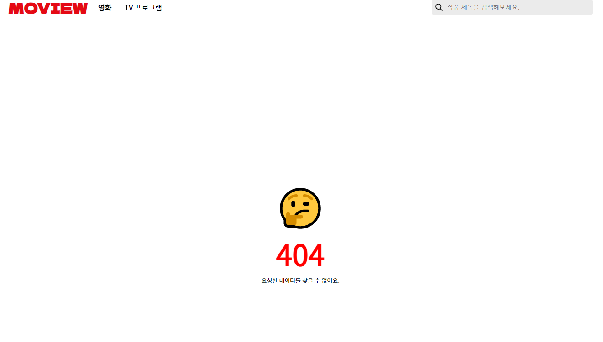

# Moview

## 배포

[웹사이트](https://mo-view.netlify.app/)

## 프로젝트 소개

TMDB API를 이용하여 개발한 영화/TV프로그램 소개 앱입니다. 추천별로 영화/TV 리스트를 제공합니다. 컨텐츠에 대한 세부내용을 확인할 수 있으며 검색기능을 제공합니다.

## 기술 스택

- React
- Typescript
- Styled-components
- Recoil
- storybook

## 프로젝트를 통해 배운점/아쉬운점

### 아토믹 디자인 패턴을 적용한 경험

컴포넌트의 재사용을 위한 아토믹 디자인 패턴을 적용해보았습니다. 컴포넌트를 atom/molecules/organism/template/page 단위로 나누는 것을 시작으로 재사용할 수 있는 컴포넌트를 만들고자 했습니다. 하지만 러닝커브가 생각보다 높고 참고할 수 있는 레퍼런스가 많지 않았습니다. 구현하고자 하는 마음이 앞서 패턴을 성공적으로 적용시키지는 못한것 같지만 아토믹 디자인 패턴을 위한 몇가지 규칙을 알게 되었습니다. 다음에 아토믹 디자인 패턴을 적용할때는 아래 사항을 지키면서 개발해볼 예정입니다.

1. 최소한 Atom은 재사용성이 높도록 설계하고, 상위 단위 컴포넌트는 융통성있게 설계할 수 있다.
2. 네이밍에 규칙을 정해 한 눈에 어떤 용도인지 알아볼 수 있도록 한다.
3. 서비스의 모든 페이지를 구상하고 그 이후에 원자를 뽑아낸다.
4. Atom
   1. 위치를 결정하는 스타일 속성은 props로 받아 재사용성을 높인다.
   2. 서비스 전체에서 일관적으로 적용되는 색이나 폰트 크기는 props로 주입하지 않는다.
   3. 동적인 효과가 필요한 atom인 경우 isAnimation 등의 props를 전달받아 애니메이션 여부를 결정하도록 한다.
   4. 로직과의 연결이 필요한 atom의 경우 커스텀 훅을 만들어 반환한 함수를 props로 전달한다.
5. Molecules
   1. 서비스에서 변하지 않는 데이터는 Molecule 에서 주입해 prop drilling을 방지한다.
   2. 한 종류의 atom으로도 molecule을 만들어도 상관 없다.

> 참고한 레퍼런스
>
> [리액트 어플리케이션 구조 - 아토믹 디자인](https://ui.toast.com/weekly-pick/ko_20200213)
>
> [atomic design 파헤치기](https://simsimjae.tistory.com/407)
>
> [아토믹 디자인(Atomic Design) 적용기 : 한계점, 단점](https://sumini.dev/guide/009-dont-use-atomic-design/)
>
> [아토믹 디자인 패턴을 실천하는 방법-1](https://medium.com/@plantstoen/%EC%95%84%ED%86%A0%EB%AF%B9-%EB%94%94%EC%9E%90%EC%9D%B8-%ED%8C%A8%ED%84%B4%EC%9D%84-%EC%8B%A4%EC%B2%9C%ED%95%98%EB%8A%94-%EB%B0%A9%EB%B2%95-1-5e8aada05209)

### Intersection Observer API를 활용하여 이미지를 레이지 로딩

컴포넌트에서 개별적으로 사용할 수 있도록 useIntersect라는 커스텀 훅을 만들었습니다.

```typescript
// useIntersect hook
const useIntersect = (
  elementRef: RefObject<Element>,
  {
    threshold = 0,
    root = null,
    rootMargin = "0%",
    freezeOnceVisible = false,
  }: Args
): IntersectionObserverEntry | undefined => {
  const [entry, setEntry] = useState<IntersectionObserverEntry>();
  const frozen = entry?.isIntersecting && freezeOnceVisible;

  const updateEntry = ([entry]: IntersectionObserverEntry[]): void => {
    setEntry(entry);
  };

  useEffect(() => {
    const node = elementRef?.current;
    const hasIOSupport = !!window.IntersectionObserver;

    if (!hasIOSupport || frozen || !node) return;

    const observerParams = { threshold, root, rootMargin };

    const observer = new IntersectionObserver(updateEntry, observerParams);

    observer.observe(node);

    return () => observer.disconnect();
  }, [elementRef, threshold, root, rootMargin, frozen]);
  return entry;
};
```

`useIntersect`는 `Intersection Observer`가 구독중인 `DOM Element`의 `entry`객체를 상태로 갖습니다.

`effect Hook`에서는 `IO`(풀네임이 길어서 줄여서 부르겠습니다)가 실행할 콜백과 옵션객체를 매개변수로하는 생성자 함수를 호출해 `IO` 인스턴스를 생성하고 `ref`로 전달받은 `DOM`객체를 구독합니다. 뷰포트에 해당 `element`가 교차한 경우 `entry`를 업데이트합니다. return 시에는 구독했던 `dom element`를 해제하여 `cleanup`합니다.

`entry`를 반환하여 컴포넌트는 `entry`의 프로퍼티를 사용할 수 있습니다.

이 hook을 사용하는 이미지 컴포넌트는 `entry`의 `isIntersecting` 프로퍼티가 참일 경우 `data-src` 속성을 `src` 속성에 할당해 실제 이미지를 로드합니다.

> 참고한 레퍼런스
>
> [https://usehooks-typescript.com/react-hook/use-intersection-observer](https://usehooks-typescript.com/react-hook/use-intersection-observer)

### Suspense, ErrorBoundary를 사용한 경험

토스에서 진행한 온라인 컨퍼런스 세션중 **비동기를 우아하게 처리하는 방법** 이라는 내용의 발표가 매우 인상적이었습니다. `Suspense`는 리액트에서 실험적으로 개발되고 있는 Concurrent 모드에서 지원하는 일부 기능 정도로 알고있었는데, `Suspense`만 독립적으로 사용해 비동기를 호출하는 컴포넌트에 렌더링을 분기할 필요 없이 로딩처리를 외부에 위임할 수 있다는 것이었습니다. `Suspense`를 사용하면 로딩에 대한 렌더링 처리를 선언적으로 할 수 있다는 장점도 있습니다. `ErrorBoundary`도 `Suspense`와 마찬가지로 컴포넌트에서 발생하는 자바스크립트 에러에 대한 처리를 외부에 위임하고 선언형으로 구현할 수 있었습니다.

```typescript
// detail page component
const ContentList = React.lazy(
  () => import("src/components/organisms/ContentList")
);
const Profile = React.lazy(() => import("src/components/organisms/Profile"));
const Overview = React.lazy(() => import("src/components/organisms/Overview"));
const CastList = React.lazy(() => import("src/components/organisms/CastList"));
const DetailPage: React.FC = () => {
  const { id, contentType } = useParams<{
    id: string;
    contentType: "movie" | "tv";
  }>();
  return (
    <ErrorBoundary> // 하위 컴포넌트에서 발생한 에러를 캐치해 fallback UI 렌더링
      <Suspense fallback={<Loader />}> // suspense로 감싸 하위 컴포넌트들의 Promise가 펜딩 중인 동안 Fallback Component 렌더링
        <Template profile={<Profile contentType={contentType} id={id} />}>
          <Overview contentType={contentType} id={id} />
          <CastList contentType={contentType} id={id} />
          <ContentList
            contentTitle="비슷한 작품"
            contentType={contentType}
            url={`${contentType}/${id}/similar`}
            wrap={true}
            titleFontSize={1.2}
          />
        </Template>
      </Suspense>
    </ErrorBoundary>
```

`ErrorBoundary`의 경우 네트워크 에러도 함께 처리하기 위해 `axios`에서 `catch method`에서 에러가 처리되기 전에 `then`의 두번째 콜백함수로 `Promise.reejct(err)`를 전달했고, `ErrorBoundary` 는 전달받은 `error` 객체를 `status`에 따라 다른 에러메시지를 유저에게 보여줄 수 있도록 구현했습니다.

```typescript
class ErrorBoundary extends React.Component<
  {},
  { hasError: boolean; message: string; status: number }
> {
  constructor(props: {}) {
    super(props);
    this.state = { hasError: false, message: "", status: null };
  }

  componentDidCatch(error: AxiosError, info: React.ErrorInfo) {
    const { status } = error.response;
    this.setState({ hasError: true });
    this.setState({ status });
    if (status === 404) {
      this.setState({ message: "요청한 데이터를 찾을 수 없어요." });
    } else if (status >= 401 && status <= 403) {
      this.setState({ message: "데이터에 접근할 수 있는 권한이 없어요." });
    } else if (status >= 500) {
      this.setState({ message: "서버에 문제가 생긴 것 같아요." });
    } else {
      this.setState({ message: "페이지 로드 중 문제가 생겼어요 ㅠㅠ" });
    }
  }

  render(): React.ReactNode {
    if (this.state.hasError) {
      return (
        <Wrapper>
          <Container>
            <Emoticon>🤔</Emoticon>
            <Text color="red" fontSize={4} fontWeight={800}>
              {this.state.status}
            </Text>
            <Text>{this.state.message}</Text>
          </Container>
        </Wrapper>
      );
    }
    return this.props.children;
  }
}
```



> 참고한 레퍼런스
>
> [https://ko.reactjs.org/docs/concurrent-mode-suspense.html](https://ko.reactjs.org/docs/concurrent-mode-suspense.html)
>
> [https://ko.reactjs.org/docs/error-boundaries.html](https://ko.reactjs.org/docs/error-boundaries.html)

## 그외 프로젝트를 통해 배운 점

- hook을 사용한 컴포넌트 상태 관리
- Recoil을 사용한 전역상태 관리
- Styled Components를 사용한 CSS-in-JS 스타일링
- React dev tools 를 사용한 프로파일링 및 성능 최적화
- 비동기 데이터 처리, 에러에 대한 처리
- React Router로 클라이언트 사이드 라우팅
